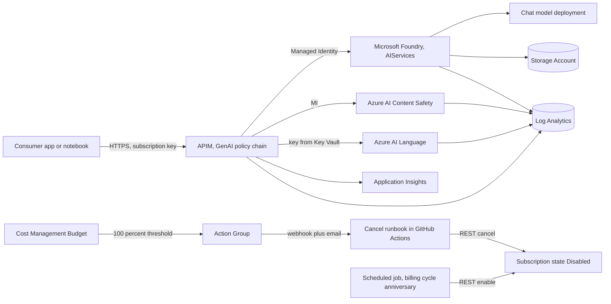
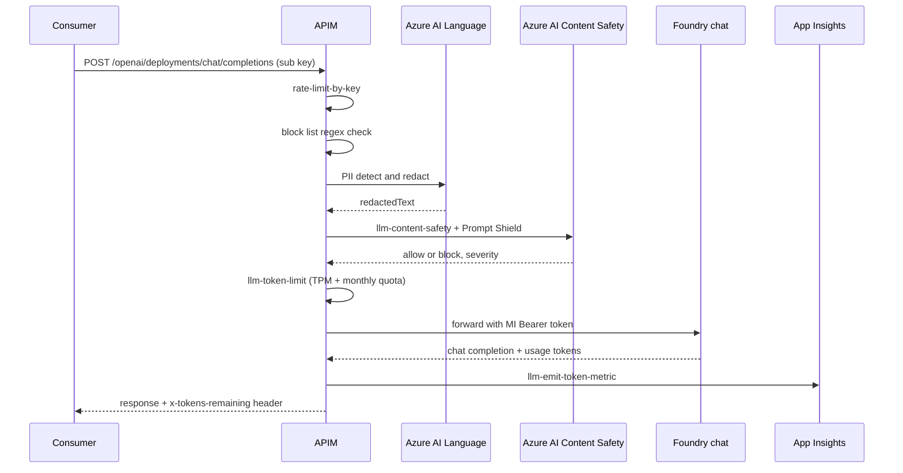

# Azure AI Hub Landing Zone

Reference implementation of Microsoft Foundry plus APIM as the standard pattern for governed, cost-capped, observable enterprise GenAI on Azure.

- Ships with both **Bicep** and **Terraform** flavors of the same stack.
- One APIM GenAI policy chain enforces every guardrail: rate limit, block list, PII redaction, Content Safety, Prompt Shield, token quota, Managed Identity backend auth.
- Hard FinOps cap with subscription cancel on breach and scheduled monthly reactivate.
- Single Application Insights workbook for tokens, cost, blocks, latency, and lifecycle events.
- Customer agnostic. MIT licensed.

```
github.com/pxbtech/azure-ai-hub-lz
```

---

## Repository layout

```
.github/workflows/        GitHub Actions
  deploy.yml              Bicep apply (manual)
  whatif.yml              Bicep what-if on PR
  teardown.yml            Bicep teardown (manual, requires RG confirmation)
  cost-cancel.yml         Cost Management poll, cancel subscription on cap breach
  cost-enable.yml         Monthly reactivate
  heartbeat.yml           Weekly commit so scheduled workflows stay armed
  terraform-plan.yml      Terraform plan on PR
  terraform-apply.yml     Terraform apply (manual)
  terraform-destroy.yml   Terraform destroy (manual, requires RG confirmation)

iac/
  bicep/
    main.bicep            Subscription scope orchestrator
    parameters/
      example.json        Sample parameters, copy and edit per environment
    modules/              Ten leaf modules
  terraform/
    providers.tf          Provider + backend (commented)
    variables.tf          All inputs
    locals.tf             Derived names
    main.tf               Resource group + module composition
    outputs.tf
    terraform.tfvars.example
    modules/              Ten leaf modules (mirror Bicep)

post-config/
  scripts/                PowerShell orchestrator + per-area scripts
  policies/apim/          chat-api-policy.xml plus openapi-chat.json
  policies/foundry/       Custom RAI policy
  alerts/                 Four Log Analytics scheduled query alert definitions

docs/
  KT-AI-Hub-for-Developers.md   Knowledge transfer for application developers
```

---

## Configuration

Every workflow ships with `schedule` triggers commented out so a fresh fork does not accumulate failing runs. Configure the items below, then uncomment the schedules when you are ready to arm the automation.

### Secrets (required for any deploy)

Set under `Settings -> Secrets and variables -> Actions -> Secrets`.

| Secret | Purpose |
| --- | --- |
| `AZURE_SUBSCRIPTION_ID` | The subscription this stack deploys into. |
| `AZURE_TENANT_ID` | Entra ID tenant of that subscription. |
| `AZURE_CLIENT_ID` | App registration / SPN client ID. |
| `AZURE_CLIENT_SECRET` | SPN client secret. Optional if you use OIDC federated credentials. |

For the Terraform workflows, OIDC federated credentials are preferred (`ARM_USE_OIDC=true`). Set up federated credentials on the SPN so `AZURE_CLIENT_SECRET` is not needed.

### Variables (optional, all have sensible defaults)

Set under `Settings -> Secrets and variables -> Actions -> Variables`.

| Variable | Default | Used by |
| --- | --- | --- |
| `MONTHLY_CAP` | `2000` | `cost-cancel.yml`. Numeric cap in your subscription's billing currency. |
| `AZURE_LOCATION` | `eastus` | `deploy.yml`, `whatif.yml`. Azure region for the deployment. |
| `DEPLOYMENT_NAME` | `aihub-main` | `deploy.yml`. Subscription-scope Bicep deployment name. |
| `DEPLOYMENT_NAME_PREFIX` | `aihub` | `whatif.yml`. Per-PR deployment name prefix. |
| `RESOURCE_GROUP_NAME` | `poc-it-rg-aihub` | `teardown.yml`, `terraform-destroy.yml`. Guard string the operator must type. |
| `BUDGET_NAME` | `poc-aihub-budget-01` | `teardown.yml`. Subscription-scope budget deletion. |

### Cost cap (currency agnostic)

The hard FinOps cap is a single numeric value (`MONTHLY_CAP`). It is compared against the `totalCost` returned by Azure Cost Management in your subscription's billing currency. Set it to whatever monthly ceiling makes sense for your environment (for example `2000` if you want a USD 2,000 cap on a USD subscription).

To match the in-cluster budget with the out-of-band runbook cap, set:
- Bicep: `budgetAmount` in `iac/bicep/parameters/example.json`
- Terraform: `budget_amount` in your tfvars
- GitHub Actions variable: `MONTHLY_CAP`

All three should agree.

---

## Quickstart: Bicep

```powershell
# 1. Validate locally
az bicep build --file iac/bicep/main.bicep

# 2. What-if against your subscription
az deployment sub what-if `
  --name aihub-main `
  --location eastus `
  --template-file iac/bicep/main.bicep `
  --parameters @iac/bicep/parameters/example.json

# 3. Deploy
az deployment sub create `
  --name aihub-main `
  --location eastus `
  --template-file iac/bicep/main.bicep `
  --parameters @iac/bicep/parameters/example.json
```

Or trigger the `Deploy AI Hub PoC` workflow from the Actions tab once secrets are configured.

## Quickstart: Terraform

```bash
cd iac/terraform
cp terraform.tfvars.example terraform.tfvars   # edit values

terraform init
terraform plan -var-file=terraform.tfvars
terraform apply -var-file=terraform.tfvars
```

Or trigger the `Terraform Apply` workflow from the Actions tab once secrets and OIDC federated credentials are configured.

### Terraform state backend

The `backend "azurerm"` block in `iac/terraform/providers.tf` is commented out. For production, configure a remote state backend (typically an Azure Storage Account in a separate management subscription) and uncomment the block.

---

## Reference architecture



### Request flow



---

## Naming convention (Microsoft CAF aligned)

Pattern: `{env}-{workload}-{type}-{NN}`. Lowercase, hyphens. Hyphen-disallowed types (storage, ACR) collapse to `{env}{workload}{type}{NN}`.

| Scope | Pattern | Example |
| --- | --- | --- |
| Resource Group | `{env}-{org}-rg-{workload}` | `poc-it-rg-aihub` |
| Resource (hyphens) | `{env}-{workload}-{type}-{NN}` | `poc-aihub-apim-01` |
| Storage / ACR | `{env}{workload}{type}{NN}` | `pocaihubst01` |
| Subnet | `{env}-{workload}-snet-{purpose}-{NN}` | `poc-aihub-snet-apim-01` |
| Private Endpoint | `{env}-{workload}-pe-{target}-{NN}` | `poc-aihub-pe-foundry-01` |
| Managed Identity | `{env}-{workload}-mi-{purpose}-{NN}` | `poc-aihub-mi-runbook-01` |

Type abbreviations follow Microsoft CAF: `apim`, `aif`, `cs`, `lang`, `kv`, `st`, `vnet`, `snet`, `law`, `appi`, `ag`, `mi`, `pe`, `pip`.

---

## APIM GenAI policy chain

Maintained in `post-config/policies/apim/chat-api-policy.xml`. Same file governs every API published through the gateway.

| Order | Policy | On trigger |
| --- | --- | --- |
| 1 | `rate-limit-by-key` | 429, no backend cost |
| 2 | Block list (choose plus regex) | 403, `x-block-reason: blocklist-match` |
| 3 | PII redaction (send-request to Language) | Prompt rewritten with placeholder tokens |
| 4 | `llm-content-safety` plus `shield-prompt` | 403, structured category |
| 5 | `llm-token-limit` (TPM plus monthly quota) | 429, `x-tokens-remaining` |
| 6 | `authentication-managed-identity` | APIM signs backend call |
| 7 | Forward to Foundry | Backend |
| 8 | `llm-emit-token-metric` | Outbound metric to Application Insights |

---

## FinOps in four layers

Spend is bounded at four independent layers. Set your monthly cap once via `MONTHLY_CAP`, `budgetAmount` (Bicep), or `budget_amount` (Terraform).

| Layer | What it enforces | Mechanism |
| --- | --- | --- |
| L1 | Per consumer TPM plus monthly token cap | APIM `llm-token-limit` policy |
| L2 | Per use case budget | Cost Management budget filtered by `usecase` tag |
| L3 | Per resource group cap | Resource group scoped Cost Management budget |
| L4 | Hard subscription cap | Subscription budget, Action Group, runbook, cancel subscription |

The L4 cap is real. When billing-month-to-date spend reaches `MONTHLY_CAP`, the runbook cancels the subscription. A second scheduled workflow reactivates it at the start of the next billing cycle. Resources are preserved, variable spend stops.

---

## Path to production

The PoC defaults sit on the bare-minimum stack so the pattern can be validated end to end. Each row below is a single Bicep or Terraform module change to harden the same architecture for production.

| Concern | PoC default | Production |
| --- | --- | --- |
| Network | All PaaS public | Private Endpoints plus Private DNS Zones |
| APIM tier | Developer (no SLA) | Premium v2 with VNet injection, AZ redundancy |
| WAF | None | Azure Front Door Premium plus WAF |
| Identity | APIM subscription keys | Entra ID OAuth2 plus JWT per product |
| Throughput | Global Standard PAYGO | Provisioned Throughput Units for steady traffic |
| Keys | Microsoft-managed | Customer-managed in Premium Key Vault or Managed HSM |
| Defender | None | Defender for AI Services plus Sentinel SIEM |
| AI tiers | Content Safety + Language F0 | S0 (pay per 1K records) |

---

## Configure GitHub Actions secrets

```bash
# Example using the gh CLI
gh secret set AZURE_SUBSCRIPTION_ID --body "<your-subscription-id>"
gh secret set AZURE_TENANT_ID       --body "<your-tenant-id>"
gh secret set AZURE_CLIENT_ID       --body "<your-spn-client-id>"
gh secret set AZURE_CLIENT_SECRET   --body "<your-spn-client-secret>"

# Optional repo variables
gh variable set MONTHLY_CAP        --body "2000"
gh variable set AZURE_LOCATION     --body "eastus"
gh variable set RESOURCE_GROUP_NAME --body "poc-it-rg-aihub"
```

---

## References

- Microsoft Cloud Adoption Framework: Azure landing zones
- Microsoft Cloud Adoption Framework: Azure AI scenarios
- Azure API Management: GenAI policies (`llm-content-safety`, `llm-token-limit`, `llm-emit-token-metric`)
- Azure subscription states (Enabled, Disabled, Warned, Cancelled)
- Microsoft Responsible AI Standard
- Azure Verified Modules (Bicep and Terraform)

---

## License

MIT. See `LICENSE`.
