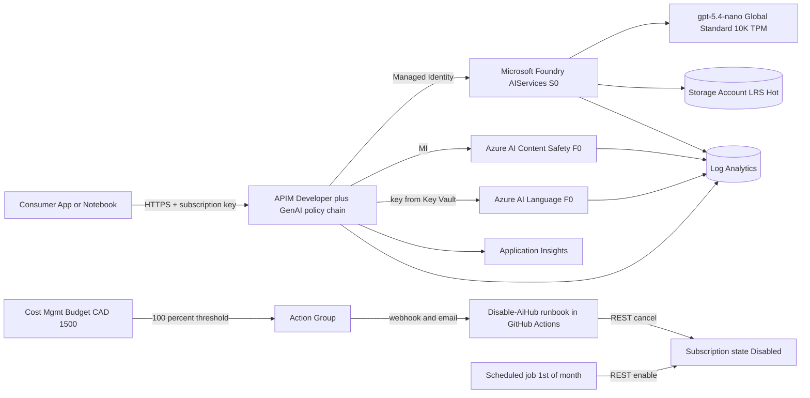
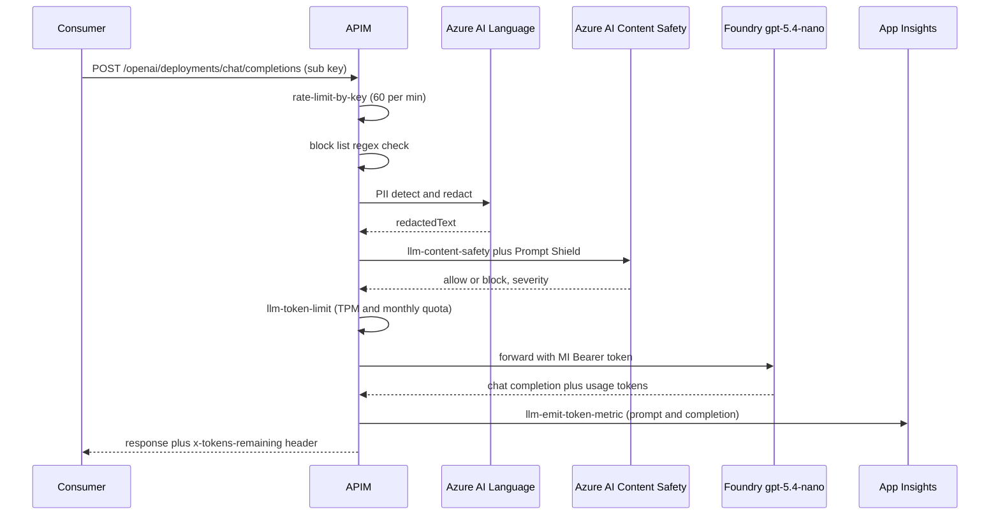
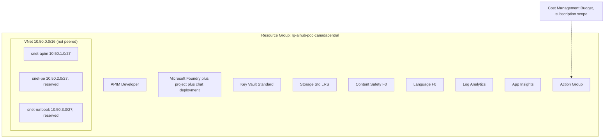
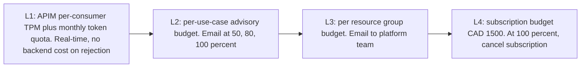
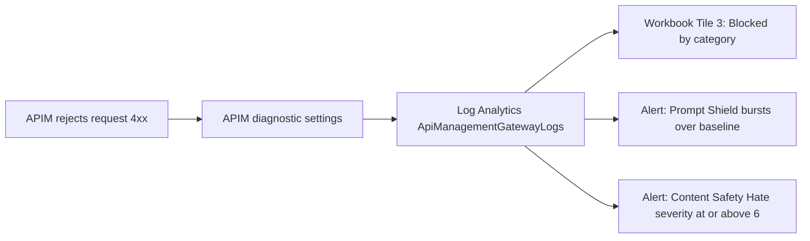
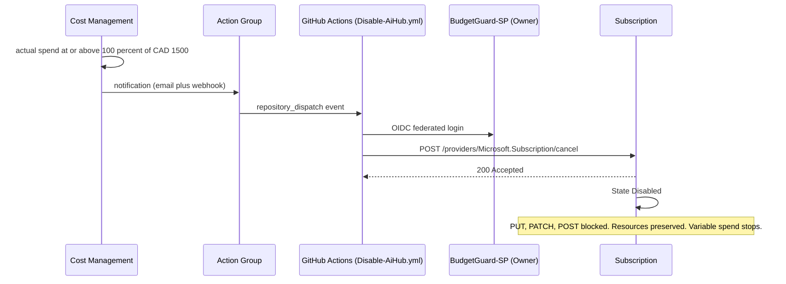
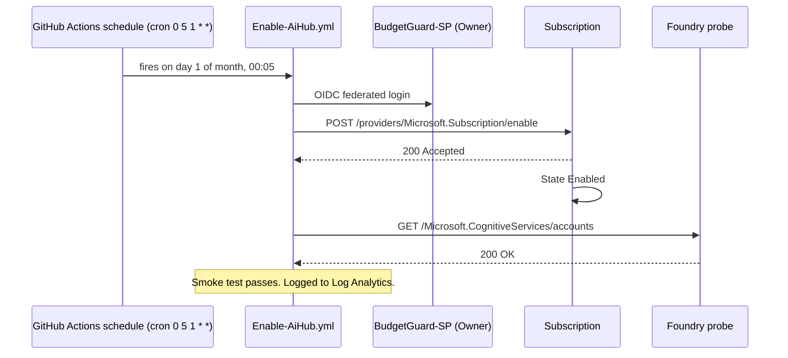

# Azure AI Hub Landing Zone, Reference Implementation

Reference implementation validating Microsoft Foundry and APIM as the standard pattern for AI deployment, governance, FinOps, and AIOps in an enterprise Azure landing zone.

Hard FinOps cap: CAD 1500 per billing cycle (configurable).

This repository contains:

- `iac/`, Bicep templates for every resource. Subscription-scope orchestrator at `iac/main.bicep` plus eleven leaf modules under `iac/modules/`.
- `post-config/`, PowerShell scripts that configure runtime policy after the Bicep deployment succeeds. Orchestrator at `post-config/scripts/Invoke-PostConfig.ps1`. Policy and alert artifacts live under `post-config/policies/` and `post-config/alerts/`.
- `.github/workflows/`, GitHub Actions for deploy, what-if on PR, teardown, hourly cost cap, monthly reactivation, and the weekly heartbeat that keeps the scheduled workflows armed.

Bicep is locally validated. To rebuild:

```powershell
az bicep build --file iac/main.bicep
```

## Status snapshot

- Target subscription: configurable via GitHub Actions secret `AZURE_SUBSCRIPTION_ID`
- Region: `canadacentral` (configurable in `iac/main.parameters.poc.json`)
- Chat model: `gpt-5.4-nano` on Global Standard, 10K TPM
- Hard FinOps cap: CAD 1500 per billing cycle (configurable)
- Runbook SPN: e.g. `BudgetGuard-SP` with Owner on the target subscription. Object id wired into GitHub Actions as `AZURE_CLIENT_ID`.

## What this repo will and will not do

| Will | Will not |
| --- | --- |
| Provision Foundry, APIM Developer, Key Vault, Storage, Content Safety F0, Language F0, Log Analytics, App Insights, VNet, Budget, Action Group | Deploy any CI/CD pipeline |
| Wire every AI request through APIM with the full GenAI policy chain | Provision Private Endpoints, WAF, Front Door, or Defender plans |
| Enforce per-consumer TPM and monthly token quota in real time | Use Provisioned Throughput Units |
| Cancel the subscription at 100 percent of CAD 1500 cap | Delete any resources |
| Reactivate the subscription on the 1st of each month | Charge for AI inference while suspended |

---

## Table of Contents

1. [Executive Summary](#1-executive-summary)
2. [Reference Architecture](#2-reference-architecture)
3. [Naming Convention](#3-naming-convention)
4. [Baseline PoC Resource Inventory](#4-baseline-poc-resource-inventory)
5. [Cost Estimation](#5-cost-estimation)
6. [Security and Guardrails per API](#6-security-and-guardrails-per-api)
7. [Monitoring, Blocked Prompts, Jailbreak Attempts, PII Detection](#7-monitoring-blocked-prompts-jailbreak-attempts-pii-detection)
8. [FinOps Strategy and Hard-Stop Automation](#8-finops-strategy-and-hard-stop-automation)
9. [AIOps Operating Model](#9-aiops-operating-model)
10. [Current State vs Future State](#10-current-state-vs-future-state)
11. [What is Deliberately Not Included](#11-what-is-deliberately-not-included)
12. [Bicep Repository Layout](#12-bicep-repository-layout)
13. [Migration Path to Production](#13-migration-path-to-production)
14. [Appendix A, API Versions Used](#appendix-a-api-versions-used)
15. [Appendix B, References](#appendix-b-references)

---

## 1. Executive Summary

### 1.1 Strategic context

This PoC validates an Azure AI Hub Landing Zone built on:

- Microsoft Foundry as the single AI model control plane.
- Azure API Management (Developer tier) as the single governed AI gateway.
- Azure AI Content Safety and Azure AI Language as the responsible-AI policy stack.
- Cost Management budgets plus an automated subscription cancel and reactivate cycle as the FinOps hard stop.

Every model endpoint is provisioned through one Foundry resource. Every consumer call is routed through APIM. Every guardrail (rate limit, throttle, content safety, prompt shield, PII redaction, block list, token quota) is enforced once, centrally, and uniformly.

### 1.2 What this PoC validates

| Capability | Mechanism |
| --- | --- |
| Standardization | One Bicep deployment provisions everything; one APIM policy chain governs every endpoint |
| Responsible AI guardrails | APIM `llm-content-safety` + `shield-prompt` + dictionary block list + PII redaction |
| Real-time FinOps | APIM `llm-token-limit` rejects over-quota requests before any backend cost is incurred |
| Hard FinOps cap | Subscription budget triggers cancel-subscription runbook at CAD 1500 |
| Auto recovery | Scheduled runbook reactivates the subscription on the 1st of each month |
| Full observability | `llm-emit-token-metric` plus APIM diagnostic logs flow to a single Log Analytics workspace |

### 1.3 Strict scope, PoC only

This document defines the baseline PoC stack and nothing more. Private Endpoints, WAF, multi-region, customer-managed keys, PTUs, and Defender plans are documented in [Section 9](#9-current-state-vs-future-state) as the future state, not the PoC state.

---

## 2. Reference Architecture

### 2.1 Logical view



### 2.2 Request flow



### 2.3 Physical view (single resource group, single VNet, no peering)



---

## 3. Naming Convention

A common enterprise naming pattern, derived from Microsoft CAF abbreviations. Adapt to your own organization's conventions.

### 3.1 Pattern

| Scope | Pattern | Example |
| --- | --- | --- |
| Subscription (informational) | `{ENV}-{SCOPE}-{ORG}` uppercase | `DEV-INT-IT`, `PRD-EXT-IT` |
| Resource Group | `{env}-{org}-rg-{workload}` | `poc-it-rg-aihub` |
| Resource Group (with scope) | `{env}-{scope}-{org}-rg-{workload}` | `dev-int-it-rg-example` |
| Standard resource (hyphens allowed) | `{env}-{workload}-{type}-{NN}` | `poc-aihub-apim-01` |
| Hyphen-disallowed resource (storage, ACR) | `{env}{workload}{type}{NN}` lowercase | `pocaihubst01` |
| Subnet | `{env}-{workload}-snet-{purpose}-01` | `poc-aihub-snet-apim-01` |
| Private endpoint | `{env}-{workload}-pe-{target}-01` | `poc-aihub-pe-foundry-01` |
| Managed identity | `{env}-{workload}-mi-{purpose}-01` | `poc-aihub-mi-runbook-01` |

Defaults in this reference: `env = poc`, `workload = aihub`, `org = it`. No `scope` segment is used in the PoC variant. When promoting to a real landing zone, add `int` (internal) or `ext` (external) as the scope segment.

### 3.2 Type abbreviations

Common enterprise plus Microsoft CAF abbreviations.

| Resource type | Abbreviation | Notes |
| --- | --- | --- |
| API Management | `apim` | CAF standard |
| AI Foundry / AIServices account | `aif` | CAF emerging (`cog` would also be valid) |
| Cognitive Services general | `cog` | Common |
| Content Safety (Cognitive) | `cs` | extension |
| AI Language Service | `lang` | extension |
| Document Intelligence | `di` | Common |
| Key Vault | `kv` | Common |
| Storage Account | `st` | No hyphens |
| Container Registry | `cr` | No hyphens |
| Virtual Network | `vnet` | Common |
| Subnet | `snet` | Common |
| NSG | `nsg` | Common |
| Private Endpoint | `pe` | Common |
| Log Analytics workspace | `law` | Common |
| Application Insights | `appi` | Common |
| Action Group | `ag` | CAF standard |
| Public IP | `pip` | CAF standard |
| Managed Identity | `mi` | CAF standard |

### 3.3 Subscription note

A sandbox / Visual Studio Enterprise subscription is fine for the PoC. For production, place the workload inside your organization's landing zone subscription and use the `{ENV}-{SCOPE}-{ORG}` convention.

---

## 4. Baseline PoC Resource Inventory

All resources are provisioned by Bicep at `iac/main.bicep` (subscription scope) into a single resource group `poc-it-rg-aihub` in Canada Central.

| # | Resource | Proposed name | SKU | Region | Purpose |
| --- | --- | --- | --- | --- | --- |
| 1 | Resource Group | `poc-it-rg-aihub` | n/a | canadacentral | Container for all PoC resources |
| 2 | Log Analytics workspace | `poc-aihub-law-01` | PerGB2018, 1 GB/day cap | canadacentral | Single diagnostic sink |
| 3 | Application Insights | `poc-aihub-appi-01` | Workspace-based | canadacentral | Sink for token metrics and AI Hub workbook |
| 4 | Virtual Network | `poc-aihub-vnet-01` | n/a | canadacentral | Address space `10.50.0.0/16`, no peering |
| 4a | Subnet, APIM | `poc-aihub-snet-apim-01` | n/a | canadacentral | Reserved for future APIM injection |
| 4b | Subnet, Private Endpoints | `poc-aihub-snet-pe-01` | n/a | canadacentral | Reserved for future PEs |
| 4c | Subnet, runbook hooks | `poc-aihub-snet-runbook-01` | n/a | canadacentral | Reserved |
| 5 | Key Vault | `poc-aihub-kv-01` | Standard, RBAC auth | canadacentral | APIM named values, runbook secret, AI keys |
| 6 | Storage Account | `pocaihubst01` | StorageV2, Standard LRS, Hot | canadacentral | Foundry project artifacts |
| 7 | Content Safety | `poc-aihub-cs-01` | F0, free up to 5K records/month | canadacentral | RAI gating plus Prompt Shield |
| 8 | AI Language | `poc-aihub-lang-01` | F0, free up to 5K records/month | canadacentral | PII detection and redaction |
| 9 | AI Foundry (AIServices) | `poc-aihub-aif-01` | S0 (no fixed cost) | canadacentral | Single AI control plane |
| 9a | Foundry project | `poc-aihub-aif-01/proj-chat` | n/a | canadacentral | Workspace for the chat use case |
| 9b | Model deployment | `poc-aihub-aif-01/chat` | gpt-5.4-nano, Global Standard, 10K TPM | canadacentral | Chat backend |
| 10 | API Management | `poc-aihub-apim-01` | Developer, 1 unit | canadacentral | Governed AI gateway with full GenAI policy chain |
| 11 | Action Group | `poc-aihub-ag-01` | n/a, email plus webhook | global | FinOps alerts to `alerts@example.com` |
| 12 | Budget | `poc-aihub-budget-01` | n/a, CAD 1500 monthly | subscription scope | Hard cap, billing-cycle 27-26 aware |
| 13 | RBAC: APIM MI on AI accounts | n/a (role assignment) | Cognitive Services User | n/a | No shared keys |

No database. Foundry's built-in Vector Stores cover PoC RAG. Conversation history can ride in the Storage Account as JSON blobs.

### 4.1 Alerts and notifications

All FinOps and security alerts route to `alerts@example.com` via Action Group `poc-aihub-ag-01`. Specifically:

- Budget thresholds at 50%, 80%, 100% of CAD 1500.
- Prompt Shield rejection rate spike (Content Safety jailbreak / indirect injection).
- Content Safety severity 4+ events (Hate, SelfHarm, Sexual, Violence).
- Subscription Disabled state lasting more than 5 days.

### 4.2 Post-deployment configuration (PowerShell / Python)

After Bicep provisions the bare resources, post-config scripts wire up the runtime policies that are easier to manage outside Bicep:

| Configuration | Target | Tool |
| --- | --- | --- |
| APIM full GenAI policy chain (rate limit, throttle, block list, PII redact, content safety, Prompt Shield, token limit, MI auth, emit metric) | `poc-aihub-apim-01` | PowerShell against APIM REST |
| Foundry content filter policy (deployment-level RAI) | `poc-aihub-aif-01/chat` | PowerShell against Cognitive Services REST |
| PII redaction backing call to AI Language | APIM named value `language-key` | PowerShell, Key Vault reference |
| Diagnostic settings for every resource to `poc-aihub-law-01` | All resources | PowerShell loop |
| Alert rules (Prompt Shield burst, Content Safety severity, Disabled state) | App Insights / Log Analytics scheduled queries | PowerShell against Monitor REST |
| Action Group receiver: `alerts@example.com` | `poc-aihub-ag-01` | Bicep parameter (set at deploy) |

---

## 5. Cost Estimation

All figures are CAD per month. Variable items are bounded by the APIM token quota and the subscription budget.

| Resource | Fixed cost | Variable cost | Notes |
| --- | --- | --- | --- |
| Microsoft Foundry (S0) | 0 | 0 (no per-resource charge) | Variable cost is on the model deployment |
| gpt-5.4-nano (Global Standard, 10K TPM) | 0 | per token, capped by quota | At 500K tokens per month per consumer, typical chat use stays well under 30 CAD per month |
| APIM Developer (1 unit) | ~70 | 0 | Largest fixed-cost line. No SLA, correct for PoC |
| Key Vault Standard | <1 | <1 (per 10K transactions) | Effectively zero |
| Storage Std LRS, StorageV2 | ~1 | <1 | Tiny PoC volumes |
| Content Safety F0 | 0 | 0 | Free up to 5,000 records per month |
| Language F0 | 0 | 0 | Free up to 5,000 records per month |
| Log Analytics | 0 | ~5 (1 GB per day cap) | Daily quota enforced in module |
| Application Insights | 0 | included | Workspace-based, no double-bill |
| VNet | 0 | 0 | No peering, no NAT |
| Action Group | 0 | 0 | Email plus webhook |
| Cost Management Budget | 0 | 0 | Native, free |
| Fixed floor | ~75 CAD | | Dominated by APIM Developer |
| Hard ceiling (variable) | | CAD 1500 | Subscription budget cancels at 100 percent |

### 4.1 What CAD 1500 actually buys (worked example)

| Scenario | Approximate token spend | Hits the cap |
| --- | --- | --- |
| 5 internal staff, casual chat, 50K tokens per day each, 20 work days | ~5M tokens | No (well under 30 CAD) |
| 1 batch summarization job, 50M tokens | ~50M tokens | Maybe, depending on input and output mix (~200 CAD) |
| Demo to a room hammering it, 500M tokens | ~500M tokens | Plausible (~1500 CAD) |
| Misconfigured loop spamming the gateway | bounded by `llm-token-limit` | Never reaches backend |

### 4.2 Where the safety net catches each layer



---

## 6. Security and Guardrails per API

Every API published through APIM inherits the same policy chain. There is no way for a use case to skip a control.

### 5.1 Policy chain order

| Order | Policy | Layer | Effect when triggered |
| --- | --- | --- | --- |
| 1 | `rate-limit-by-key` | Inbound | 429, no backend cost, `x-rate-remaining` header |
| 2 | Block list (`choose` plus regex) | Inbound | 403, `x-block-reason: blocklist-match` |
| 3 | PII redaction (`send-request` to Azure AI Language) | Inbound | Prompt body rewritten with `[PERSON]`, `[EMAIL]`, etc. |
| 4 | `llm-content-safety` (Hate, Sexual, SelfHarm, Violence, plus Prompt Shield) | Inbound | 403, structured category code |
| 5 | `llm-token-limit` (TPM plus monthly quota) | Inbound | 429, `x-tokens-remaining`, `x-quota-remaining` |
| 6 | `authentication-managed-identity` | Inbound | APIM signs request as itself |
| 7 | Forward to Foundry backend | Backend | n/a |
| 8 | `llm-emit-token-metric` | Outbound | Metric dimensioned by API, Subscription, Product, UseCase |

### 5.2 Rate limiting and throttling

| Concern | Mechanism | Default | Where to tune |
| --- | --- | --- | --- |
| Accidental request loops | `rate-limit-by-key` | 60 requests per minute per subscription key | Inline in `policies/chat-api-policy.xml` |
| Token burst protection | `llm-token-limit tokens-per-minute` | 2,000 TPM per subscription key | Same |
| Monthly cost ceiling per consumer | `llm-token-limit token-quota` plus `Monthly` period | 500,000 tokens per month per subscription key | Same |
| Pre-estimate prompt tokens | `estimate-prompt-tokens="true"` | Enabled | n/a |

### 5.3 Responsible AI, Hate, Sexual, SelfHarm, Violence

| Category | Threshold | Output type | Action on breach |
| --- | --- | --- | --- |
| Hate | 4 | FourSeverityLevels | 403 with category in response |
| Sexual | 4 | FourSeverityLevels | 403 |
| SelfHarm | 4 | FourSeverityLevels | 403 |
| Violence | 4 | FourSeverityLevels | 403 |

Threshold 4 is the standard medium severity gate. Lower to 2 for stricter posture, raise to 6 for permissive.

### 5.4 Prompt poisoning, jailbreak attempts, indirect prompt injection

`shield-prompt="true"` on the `llm-content-safety` policy activates Azure AI Prompt Shield at the same call. Prompt Shield detects:

| Attack class | What it covers | PoC behavior |
| --- | --- | --- |
| Direct jailbreak or role-play bypass | Prompts attempting to override system instructions | 403, category `JailbreakAttack` |
| Indirect prompt injection | Injection via untrusted content the model is asked to read (e.g. email body, web page) | 403, category `IndirectAttack` |

### 5.5 PII redaction (in-flight)

APIM calls Azure AI Language `:analyze-text` with the PII recognition skill and `redactionPolicy.policyKind="entityMask"`. The returned `redactedText` replaces the user message before the prompt reaches Foundry. Original PII text is never logged. Only the redacted form and the entity types are persisted, so audit can see "an EMAIL was redacted" without ever storing the email itself.

### 5.6 Enterprise block list

A simple `choose` plus regex policy in the inbound chain denies any prompt matching a dictionary of organization-specific terms (codenames, internal project IDs, regulated strings). Maintained in code at `policies/chat-api-policy.xml`. Change requires a PR.

### 5.7 Identity

| Hop | Auth | Why |
| --- | --- | --- |
| Consumer to APIM | APIM subscription key | Per-use-case metering counter for `llm-token-limit` |
| APIM to Foundry | System-Assigned Managed Identity plus `Cognitive Services User` role | No shared keys to rotate |
| APIM to Content Safety | Same MI plus same role | Same |
| APIM to Language | Named value `language-key` (PoC), Key Vault reference (production) | F0 of Language does not currently support data-plane MI in some regions |
| Runbook to Subscription | SPN `BudgetGuard-SP` (Owner) | Cancel and reactivate REST endpoints |

---

## 7. Monitoring, Blocked Prompts, Jailbreak Attempts, PII Detection

### 6.1 Single pane of glass

Application Insights workbook AI Hub PoC is the canonical view. Six tiles, role-filtered:

| Tile | Source | Dimension |
| --- | --- | --- |
| Tokens by use case (24h, 7d, 30d) | `llm-emit-token-metric` custom metric `aihub` | UseCase, ProductId, Subscription |
| Per-use-case cost estimate (MTD plus projected) | Custom Kusto: tokens times unit rate | UseCase |
| Blocked prompts by category | Log Analytics `ApiManagementGatewayLogs` filtered to 4xx plus `x-block-reason` | category (blocklist, content-safety, prompt-shield, quota, pii) |
| P50, P95, P99 latency per API | APIM HTTP telemetry | API ID |
| Quota utilization, top 10 consumers | App Insights metric `aihub/tokens` | SubscriptionId |
| Suspend and recover events | Custom Log Analytics event from runbooks | timestamp |

### 6.2 What gets captured on a block



### 6.3 Alerts shipped in this PoC

| Alert | Trigger | Routes to |
| --- | --- | --- |
| Prompt Shield rate spike | Rejections greater than 3 times rolling baseline per minute | Security team |
| Content Safety severity at or above 4 (Hate, SelfHarm) | Single event | Security team |
| Per-use-case budget 80 percent | Cost Management | Use case owner |
| Subscription budget 50, 80, 100 percent | Cost Management | FinOps inbox at all thresholds. Runbook fires at 100 percent |
| Subscription Disabled longer than 5 days | Log Analytics scheduled query | Platform team (90-day delete guardrail) |

---

## 8. FinOps Strategy and Hard-Stop Automation

### 7.1 Four-layer FinOps model

| Layer | What it enforces | Mechanism | Reaction time |
| --- | --- | --- | --- |
| L1 | Per-consumer TPM and monthly token cap | APIM `llm-token-limit` | Real time. Request rejected before backend |
| L2 | Per-use-case CAD budget | Cost Management budget filtered by `usecase` tag | Hours (Cost Mgmt refresh) |
| L3 | Per resource group cap | RG-scoped Cost Management budget | Hours |
| L4 | Hard subscription cap, CAD 1500 | Subscription budget to Action Group to runbook to `cancel subscription` REST | Hours from trigger to suspend. Immediate cost stop on suspend |

### 7.2 The hard-stop sequence



### 7.3 Why Disabled, not Delete

The subscription `Disabled` state, per Microsoft's published lifecycle, preserves resources and stops variable spend. VMs deallocate. PaaS data planes go offline. Storage becomes read-only. Recovery is a single REST call within the 90-day reactivation window. Cost on day 2 of Disabled state is effectively zero plus a few cents of storage at rest.

Reference: [Azure subscription states](https://learn.microsoft.com/en-us/azure/cost-management-billing/manage/subscription-states).

### 7.4 The reactivation sequence



### 7.5 Why the runbook does NOT live inside the PoC subscription

Once the subscription is `Disabled`, POST operations are blocked. A runbook hosted inside the subscription cannot fire its own reactivation. Therefore the scheduler must sit outside.

Two acceptable hosts. This PoC uses GitHub Actions:

| Option | Footprint | When to pick |
| --- | --- | --- |
| GitHub Actions (chosen) | Zero Azure footprint outside PoC. Scheduler is `cron` on the workflow. SPN auth via OIDC. | PoC scope, no second subscription available |
| Separate Management subscription with Automation Account | Standard production landing-zone pattern. SPN with cross-sub Owner. | Production, when a Management subscription already exists |

### 7.6 The 90-day guardrail

A Log Analytics scheduled-query alert checks every 24h whether the subscription has been in `Disabled` state for more than 5 days. If true, it pages the platform team. Disabled subscriptions are permanently deleted at 90 days. The 5-day alert gives a 17x safety margin.

### 7.7 Resource-preservation contract

| When suspended | What state survives | What state is lost |
| --- | --- | --- |
| All ARM resource definitions | Yes | n/a |
| Storage data at rest | Yes (read-only) | n/a |
| Foundry project plus deployment definitions | Yes | n/a |
| APIM API and policy XML | Yes | n/a |
| In-flight requests | n/a | All non-idempotent in-flight requests fail |
| App Insights and Log Analytics historical data | Yes | n/a |
| Variable spend | n/a | Stops |

---

## 9. AIOps Operating Model

### 8.1 Roles

| Role | Owns | Approves | Informed of |
| --- | --- | --- | --- |
| Platform team | The AI Hub itself: Bicep, APIM policy, runbooks, workbook, budget | New use case onboarding, model deployments, tier changes | Per-use-case consumption, budget breaches |
| Use case owner | Their application code and product config | Their TPM and quota tier inside platform caps | Blocked-prompt rate, their cost |
| FinOps team | Cost Management budgets, chargeback | Subscription cap, per-use-case cap values | Every budget alert |
| Security | Content Safety thresholds, block list, PII rules | Threshold and block list changes | Prompt Shield events, severity at or above 4 events |

### 8.2 Standardized use-case onboarding (five steps)

1. Owner submits TPM and monthly token estimate.
2. Platform team adds a new APIM product plus budget entry in a Bicep PR.
3. CI runs `what-if`, deploys, smoke tests three rejections (content safety, token quota, block list).
4. Subscription key issued. Handover document with quota, base URL, threshold values.
5. Owner integrates, validates against acceptance criteria.

### 8.3 Standardized model deployment

A new model is a Bicep parameter change. Example:

```bicep
module embeddings 'modules/model-deployment.bicep' = {
  scope: rg
  params: {
    foundryName: foundry.outputs.foundryName
    deploymentName: 'text-embedding-3-small'
    modelName: 'text-embedding-3-small'
    modelVersion: '1'
    skuName: 'Standard'
    skuCapacity: 50
  }
}
```

---

## 10. Current State vs Future State

| Concern | PoC (now) | Production (future) |
| --- | --- | --- |
| Network exposure | All PaaS public. Foundry ACL allow-lists APIM outbound IPs | Private Endpoints plus Private DNS Zones on every PaaS |
| APIM tier | Developer, no SLA | Premium v2 with VNet injection, AZ redundancy |
| WAF | None | Azure Front Door Premium plus WAF (OWASP plus bot manager) |
| Identity | APIM subscription keys for consumers | Entra ID OAuth2 with JWT on every product (`validate-jwt` slot already reserved) |
| HA and DR | Single region, no zone redundancy | Multi-region active-active APIM Premium v2. ZRS storage |
| Throughput | PAYGO Global Standard | Provisioned Throughput Units for steady production traffic |
| Key management | Microsoft-managed encryption | Customer-managed keys in Premium Key Vault or Managed HSM |
| Defender | None | Defender for AI Services plus Sentinel SIEM |
| Content Safety and Language tier | F0 (5K records per month free) | S0 (pay per 1K records) |
| Subscription cap | Cancel-subscription on CAD 1500 breach | Same plus per-PTU cost dashboards in Power BI |
| Network egress | Default route | Azure Firewall or NVA egress |
| Backup and DR | Azure defaults | GRS, longer retention, IaC redeployable in under 30 min |

---

## 11. What is Deliberately Not Included

The following are scoped out of this PoC. Each is a deliberate decision, not an oversight.

| Excluded | Reason |
| --- | --- |
| Private Endpoints, Private DNS Zones | Adds cost without changing what the PoC validates |
| Azure WAF, Front Door | Same |
| Multi-region or zonal redundancy | Time-bounded PoC, no SLA requirement |
| Customer-managed keys (CMK) | Microsoft-managed encryption is sufficient for PoC data |
| Defender for AI Services and other paid Defender plans | Cost-prohibitive for PoC |
| Provisioned Throughput Units | Invalidates the scale-to-zero cost shape |
| Azure Managed Redis for semantic cache | Cost-prohibitive. Policy slot reserved |
| Azure AI Search for RAG | Foundry built-in Vector Stores cover PoC RAG |
| Cosmos DB, SQL, any database | Storage plus JSON blobs cover PoC persistence needs |
| ALZ AI policy initiative | Only the L4 deny-all-writes policy is created |
| CI and CD pipelines | User explicitly excluded. Deferred to a later iteration |

---

## 12. Repository Layout

The repository separates infrastructure provisioning (Bicep) from runtime configuration (PowerShell). Bicep is "what the resources are". PowerShell is "how they are configured". This split is intentional. Policy iteration does not require redeploying infrastructure, and resource SKUs do not depend on policy state.

```
.github/
└── workflows/
    ├── deploy.yml                   # Manual end-to-end deploy. Stage 1 what-if, Stage 2 Bicep apply, Stage 3 post-config.
    ├── whatif.yml                   # Read-only what-if on every pull request touching iac/.
    ├── teardown.yml                 # Manual, requires typed confirmation of the RG name.
    ├── cost-cancel.yml              # Hourly poll. Cancels subscription when BillingMonthToDate spend >= CAD 1500.
    ├── cost-enable.yml              # 00:05 UTC on the 27th, reactivates subscription at the start of the billing cycle.
    └── heartbeat.yml                # Weekly tiny commit so the scheduled workflows are not paused after 60 days.

iac/
├── main.bicep                       # Subscription-scope orchestrator. Derives every name from envCode + workload + type + instance.
├── main.parameters.poc.json         # PoC parameter values. No secrets.
└── modules/
    ├── observability.bicep          # Log Analytics PerGB2018 with 1 GB/day cap, workspace-based App Insights.
    ├── network.bicep                # VNet 10.50.0.0/16 with three reserved subnets (apim, pe, runbook).
    ├── keyvault.bicep               # Key Vault Standard, RBAC auth, soft delete enabled.
    ├── storage.bicep                # StorageV2 Standard LRS Hot, no public blob access, TLS 1.2+.
    ├── content-safety.bicep         # Microsoft.CognitiveServices kind ContentSafety, F0.
    ├── language.bicep               # Microsoft.CognitiveServices kind TextAnalytics, F0.
    ├── foundry.bicep                # AIServices S0 with allowProjectManagement, one project, one gpt-5.4-nano deployment.
    ├── apim.bicep                   # APIM Developer 1 unit, system-assigned MI. APIs and policies attached in post-config.
    ├── action-group.bicep           # Action Group with email receiver alerts@example.com.
    └── budget.bicep                 # Subscription-scope CAD 1500 budget, 50/80/100 notifications.

post-config/
├── scripts/
│   ├── Common-Functions.ps1         # Logging helpers, Get-DeploymentOutputs, Invoke-AzApi with retry.
│   ├── Invoke-PostConfig.ps1        # Orchestrator. Reads Bicep outputs, runs each Set-*.ps1 in order.
│   ├── Set-RbacAssignments.ps1      # APIM MI -> Cognitive Services User on Foundry, Content Safety, Language.
│   ├── Set-KeyVaultSecrets.ps1      # Pulls Language and Content Safety primary keys, writes them to KV.
│   ├── Set-DiagnosticSettings.ps1   # Wires every resource diagnostic to Log Analytics. Idempotent.
│   ├── Set-ApimGateway.ps1          # Backends, named values (with KV references), API import, product, policy attach.
│   ├── Set-FoundryRaiPolicy.ps1     # Custom Foundry RAI policy aihub-poc-strict, binds to chat deployment.
│   └── Set-AlertRules.ps1           # Loads alerts/*.json and creates scheduledQueryRules wired to the Action Group.
├── policies/
│   ├── apim/
│   │   ├── chat-api-policy.xml      # Full GenAI policy chain (rate limit, block list, PII redact, content safety + Prompt Shield, llm-token-limit, MI auth, emit metric).
│   │   └── openapi-chat.json        # OpenAPI definition imported into APIM as the openai-chat API.
│   └── foundry/
│       └── rai-policy.json          # Strict Foundry content filter (Jailbreak, IndirectAttack, Protected Material).
└── alerts/
    ├── 01-prompt-shield-burst.json  # Prompt Shield rejection rate > 5/5min.
    ├── 02-content-safety-severity.json # Single Content Safety category >= severity 4.
    ├── 03-subscription-disabled.json   # Subscription in Disabled state > 5 days (90-day delete guardrail).
    └── 04-keyvault-access-denied.json  # Any Key Vault Forbidden response.
```

### 12.1 Validation

Local validation (no deployment, no Azure calls):

```powershell
az bicep build --file iac/main.bicep
```

What-if against the live subscription (read-only, no resources change):

```powershell
az deployment sub what-if --location canadacentral `
  --template-file iac/main.bicep `
  --parameters @iac/main.parameters.poc.json
```

End-to-end deployment is run via the `Deploy AI Hub PoC` workflow under Actions. Manual trigger only. Three stages, in order: what-if, deploy, post-config. Inputs allow running what-if alone or skipping post-config.

---

## 13. Migration Path to Production

Each future-state row above corresponds to a Bicep module change, not a re-architecture:

| Step | Module change | Effort |
| --- | --- | --- |
| 1. Move APIM to Standard v2 | `apim.bicep` sku.name plus add PE | Tier change, no API re-import |
| 2. Add Private Endpoints | new module `private-endpoints.bicep` plus Private DNS Zones | New module |
| 3. Move Content Safety and Language to S0 | sku.name parameter | One-line change |
| 4. Add Defender | new module `defender.bicep` | New module |
| 5. Upgrade to Entra ID OAuth | swap subscription-key product to `validate-jwt` policy | Policy XML change |
| 6. Add multi-region | duplicate `main.bicep` deployment in second region, add Traffic Manager | New module |

---

## Appendix A, API Versions Used

| Resource type | API version | Stability |
| --- | --- | --- |
| `Microsoft.Resources/resourceGroups` | 2024-03-01 | Stable |
| `Microsoft.OperationalInsights/workspaces` | 2023-09-01 | Stable |
| `Microsoft.Insights/components` | 2020-02-02 | Stable |
| `Microsoft.Network/virtualNetworks` | 2024-05-01 | Stable |
| `Microsoft.KeyVault/vaults` | 2024-11-01 | Stable |
| `Microsoft.Storage/storageAccounts` | 2024-01-01 | Stable |
| `Microsoft.CognitiveServices/accounts` (Foundry, ContentSafety, Language) | 2025-12-01 | Stable |
| `Microsoft.CognitiveServices/accounts/projects` | 2025-12-01 | Stable |
| `Microsoft.CognitiveServices/accounts/deployments` | 2025-12-01 | Stable |
| `Microsoft.ApiManagement/service` (and children) | 2024-05-01 | Stable |
| `Microsoft.Insights/actionGroups` | 2024-10-01-preview | Preview (email plus webhook only) |
| `Microsoft.Consumption/budgets` | 2024-08-01 | Stable |
| `Microsoft.Authorization/roleAssignments` | 2022-04-01 | Stable |

---

## Appendix B, References

- [Foundry Models region availability](https://learn.microsoft.com/en-us/azure/foundry/foundry-models/concepts/models-sold-directly-by-azure-region-availability)
- [Foundry model lifecycle and retirements](https://learn.microsoft.com/en-us/azure/ai-foundry/openai/concepts/model-retirements)
- [Microsoft Foundry pricing](https://azure.microsoft.com/en-us/pricing/details/ai-foundry/)
- [APIM `llm-token-limit` policy](https://learn.microsoft.com/en-us/azure/api-management/llm-token-limit-policy)
- [APIM `llm-emit-token-metric` policy](https://learn.microsoft.com/en-us/azure/api-management/llm-emit-token-metric-policy)
- [APIM `llm-content-safety` policy](https://learn.microsoft.com/en-us/azure/api-management/llm-content-safety-policy)
- [Azure subscription states (Disabled, Warned, Cancelled)](https://learn.microsoft.com/en-us/azure/cost-management-billing/manage/subscription-states)
- [Cost Management budget Bicep schema](https://learn.microsoft.com/en-us/azure/templates/microsoft.consumption/budgets)
- [Cognitive Services User built-in role](https://learn.microsoft.com/en-us/azure/role-based-access-control/built-in-roles/ai-machine-learning#cognitive-services-user)
