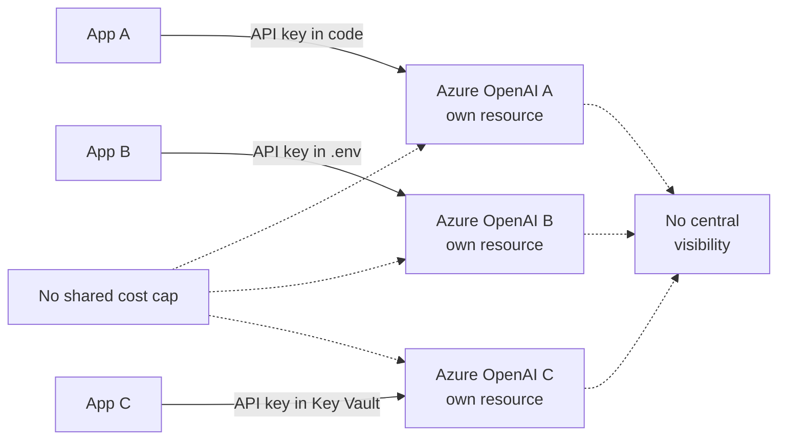
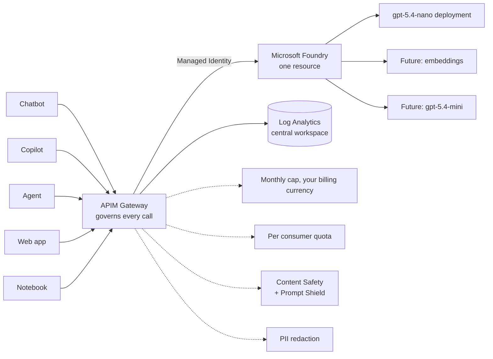
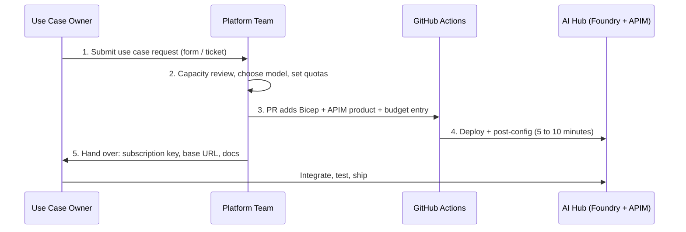
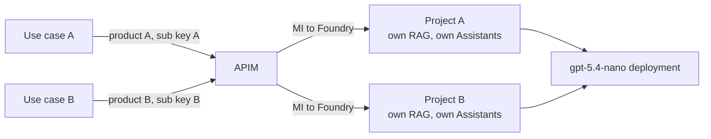
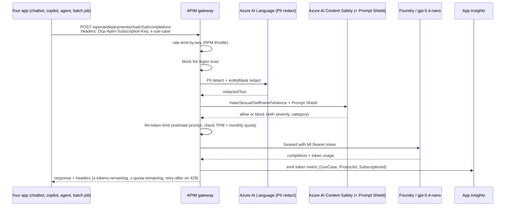

# AI Hub for Developers, Knowledge Transfer

Audience: application developers, AI engineers, data scientists, product owners, and anyone integrating an AI capability into an enterprise workload. This document explains what the AI Hub is, how to consume it, how cost and safety controls are enforced for you automatically, and exactly what steps you take from "I have an idea" to "my chatbot is calling a governed AI endpoint in production".

Reference implementation. Free to adapt.

---

## Table of Contents

1. [Why the AI Hub exists](#1-why-the-ai-hub-exists)
2. [Life before the AI Hub (current state for most teams)](#2-life-before-the-ai-hub-current-state-for-most-teams)
3. [Life with the AI Hub (target state)](#3-life-with-the-ai-hub-target-state)
4. [Mental model: one Foundry, one Gateway, many use cases](#4-mental-model-one-foundry-one-gateway-many-use-cases)
5. [The developer journey, end to end](#5-the-developer-journey-end-to-end)
6. [Should I have one Foundry project per use case?](#6-should-i-have-one-foundry-project-per-use-case)
7. [How a single request flows through the Hub](#7-how-a-single-request-flows-through-the-hub)
8. [What gets enforced on every request, automatically](#8-what-gets-enforced-on-every-request-automatically)
9. [Cost governance per endpoint](#9-cost-governance-per-endpoint)
10. [Monitoring you get for free, per endpoint](#10-monitoring-you-get-for-free-per-endpoint)
11. [Code samples: calling the Hub from your app](#11-code-samples-calling-the-hub-from-your-app)
12. [Day-2 operations](#12-day-2-operations)
13. [Anti-patterns and what not to do](#13-anti-patterns-and-what-not-to-do)
14. [FAQ for developers](#14-faq-for-developers)
15. [Glossary](#15-glossary)

---

## 1. Why the AI Hub exists

The Hub solves five problems that hit every team the moment they try to ship anything backed by an LLM.

| Problem | What used to happen | What the Hub does |
| --- | --- | --- |
| Inconsistent guardrails | Each team configured content safety, PII redaction, rate limits, and token caps in their own app code, if at all. | One APIM policy chain applies the same controls to every request. You cannot deploy a use case that bypasses them. |
| Unbounded cost | A bad prompt loop or a misconfigured agent could spend thousands overnight. | Real-time token quota per consumer rejects over-budget requests before they reach the model. A subscription-level hard cap suspends the entire environment if it is ever breached. |
| Key sprawl | Each app needed an OpenAI key. Keys ended up in code, in .env files, in screenshots. | Apps authenticate to APIM with a subscription key. APIM authenticates to Azure AI with a Managed Identity. The actual model key never leaves Azure. |
| No observability | Teams could not tell who used how many tokens, what was blocked, or why responses were slow. | Every request emits token metrics, latency, and policy decisions to a central workspace. One dashboard, role-filtered. |
| No standard onboarding | Adding a use case meant a multi-week design exercise per team. | New use case onboarding is a 5-step Bicep-parametrized process that takes hours, not weeks. |

---

## 2. Life before the AI Hub (current state for most teams)

If your team has built anything against Azure OpenAI today, this is probably what it looks like. The Hub is designed to replace this picture entirely.



Key pain points:

- Each team provisions its own Cognitive Services account, often in a different region, often on different SKUs.
- Content safety policies vary or are missing.
- PII may or may not be redacted before going to the model. The team decides per app.
- Token spend is invisible until the bill arrives.
- Quota negotiation with Microsoft happens N times, once per account, instead of centrally.
- Switching models requires app code changes everywhere.

---

## 3. Life with the AI Hub (target state)

Every AI capability for every team flows through one Foundry and one APIM. Guardrails are applied once and inherited by all.



What changes for you, the developer:

- You do not provision your own Cognitive Services account.
- You do not store an OpenAI API key.
- You call `https://poc-aihub-apim-01.azure-api.net/...` with an APIM subscription key.
- You inherit content safety, PII redaction, rate limiting, token quotas, and metrics with zero code in your app.
- You see your own consumption in the central workbook, filtered to your use case.

---

## 4. Mental model: one Foundry, one Gateway, many use cases

Three layers, three jobs.

| Layer | What lives here | Who owns it |
| --- | --- | --- |
| Foundry (the model control plane) | The Foundry account, the projects, the model deployments (e.g. gpt-5.4-nano). | Platform team. You never edit this directly. |
| APIM (the gateway) | One API per logical capability (chat, embeddings, future ones). Products per use case. Subscription keys per consumer. Policy chain attached at the API scope. | Platform team owns the gateway and policy. You own your subscription key and how you call the URL. |
| Your application | The chatbot, copilot, agent, web app, notebook, batch job, anything that consumes AI. | You. |

The platform team's contract with you is simple: call the gateway URL with your subscription key, get a governed AI response back. Everything else (auth to Foundry, key rotation, model swap, content safety, PII, cost) is invisible to your app.

---

## 5. The developer journey, end to end

The same five-step process every time. Onboarding a new use case takes hours, not weeks.



### Step 1, Submit the use case request

You file a request with these inputs:

| Input | Example | Why we need it |
| --- | --- | --- |
| Use case name (kebab-case) | `permit-summarizer` | Becomes the APIM product name, the tag, the budget identifier |
| Description | "Summarize incoming building permit applications for the planning team" | Audit trail and use-case onboarding doc |
| Expected requests per minute | 30 | Sets the APIM `rate-limit-by-key` value |
| Expected tokens per minute | 5,000 | Sets `llm-token-limit tokens-per-minute` |
| Expected tokens per month | 2,000,000 | Sets `llm-token-limit token-quota` monthly |
| PII sensitivity | Medium (contains addresses, names) | Confirms PII redaction stays on |
| Required model family | Chat (gpt-5.4-nano) or Embeddings | Determines which API to bind to |
| Owner team and email | planning-tech-team | Routes alerts and budget notifications |
| Production target date | 2026-08-15 | Capacity planning |

### Step 2, Capacity review

Platform team confirms:

- Subscription headroom is available (current MTD plus your projection stays under the configured monthly cap).
- The model you want is available in the deployment region and not retiring within your runway.
- Your TPM and quota numbers are reasonable. Outliers get clarified.
- No use case already exists that would be a better fit for your need.

### Step 3, Bicep PR

The platform team opens a PR that adds (or edits) three things in the repo:

1. A new APIM product in `post-config/scripts/Set-ApimGateway.ps1` (or by parameter file, depending on which path is chosen).
2. A Cost Management budget tagged with your `usecase` value.
3. Any model deployment additions if the model is new.

The PR triggers `whatif.yml` automatically, so you can review the resource diff in the PR check.

### Step 4, Deploy

Merge triggers `deploy.yml` (currently manual workflow_dispatch, will move to merge-trigger when promoted). Three sequential stages run:

| Stage | What runs | Typical time |
| --- | --- | --- |
| What-if | `az deployment sub what-if` | 1 to 2 min |
| Deploy  | `az deployment sub create`, idempotent against unchanged resources | 1 to 2 min for incremental change; up to 45 min for first-time APIM provisioning |
| Post-config | PowerShell scripts apply RBAC, KV secrets, diagnostics, APIM gateway config, RAI policy, alert rules | 5 to 10 min |

### Step 5, Hand-over

You receive:

- Your APIM **subscription key** (single value, treat like a password, store in Key Vault or your platform secret store)
- Your **base URL**: `https://poc-aihub-apim-01.azure-api.net/openai`
- Your **product name** (which is also the value you put in the `x-use-case` header for metrics)
- A link to the **AI Hub workbook**, pre-filtered to your use case
- Your **quota numbers** (TPM, monthly tokens, RPM)
- The **block list** terms currently configured (so you can avoid accidentally triggering them in test prompts)

You are now live. Integrate, test, ship.

---

## 6. Should I have one Foundry project per use case?

Short answer: yes, by default. Use one Foundry project per use case unless the use cases genuinely share the same RAG corpus, same Assistants, and same data isolation requirements.

### When to use one project per use case (recommended)

- Each use case has its own files, threads, vector store, or Assistants.
- Each use case may have a different data classification (some are public-data, some are internal).
- You want clear per-use-case audit trails inside Foundry.
- You want the option to grant Foundry-level data plane access (Cognitive Services User on the project, not the whole account) to use case team members.
- You want different RAI policies on different use cases (some strict, some permissive).

This is the default in the PoC: `poc-aihub-aif-01/proj-chat` is the project for the chat use case.

### When to share a project across use cases

- The use cases share the exact same RAG corpus and Assistant configuration.
- The use cases are tightly coupled (e.g. all subroutines of the same agent).
- You want to share threads or sessions between them.

### Why the project boundary matters even though APIM does the heavy lifting

APIM handles **per consumer** controls (rate limit, token quota, cost). The project handles **data and assistant isolation**. They are orthogonal. You may have one APIM product per consumer (because they each get their own key and quota), and one Foundry project for the underlying data world they share. Or you may want both at one-per-use-case granularity.



The model deployment itself can (and should) be shared across projects when they target the same model. You do not need to redeploy gpt-5.4-nano per use case. Capacity is shared, costs are tracked per use case via APIM tagging.

---

## 7. How a single request flows through the Hub



Headers you should always pay attention to in the response:

| Header | Meaning | What to do |
| --- | --- | --- |
| `x-tokens-remaining` | Tokens left in this minute's TPM window | If trending to zero, slow down or batch |
| `x-quota-remaining` | Tokens left in the monthly quota | If under 10%, plan a quota request |
| `x-tokens-consumed` | What this request used | Use for client-side billing or per-request accounting |
| `retry-after` | When a 429 was returned, wait this many seconds | Implement linear backoff using this value |
| `x-rate-remaining` | Coarse RPM remaining | Stop hammering the gateway |
| `x-block-reason` | If 403, why (blocklist-match, content-safety, prompt-shield, pii) | Surface to your user appropriately; do not retry |

---

## 8. What gets enforced on every request, automatically

You do not write any of this in your app. It happens at the gateway.

| Control | Where | What it does | What a failure looks like to your app |
| --- | --- | --- | --- |
| Coarse rate limit | `rate-limit-by-key` | Caps request count per minute per subscription key | 429 with `retry-after` |
| Block list | Inbound regex | Refuses prompts containing banned terms | 403 with `x-block-reason: blocklist-match` |
| PII redaction | Calls Azure AI Language | Replaces user message text with masked entities before forwarding | Silent. Your app does not see the redaction. Foundry only ever sees the redacted text. |
| Content Safety | Calls Azure AI Content Safety | Blocks Hate, Sexual, SelfHarm, Violence at threshold 4 | 403 with category in body |
| Prompt Shield | `shield-prompt=true` on the same Content Safety call | Detects jailbreak attempts and indirect prompt injection | 403 with `x-block-reason: prompt-shield` |
| Token limit | `llm-token-limit` | Pre-estimates the prompt cost and rejects if over TPM or monthly quota | 429 with `retry-after` and `x-quota-remaining: 0` |
| Auth to Foundry | `authentication-managed-identity` | APIM signs the upstream call as itself | Silent. Your app does not see the bearer token. |
| Foundry RAI policy | Bound to the chat deployment | Second-layer content filter (Hate, Sexual, SelfHarm, Violence, Jailbreak, Protected Material) inside the model boundary | Standard OpenAI content_filter response object on the streamed reply |
| Telemetry | `llm-emit-token-metric` | Emits prompt and completion tokens dimensioned by use case | Silent. Visible in the workbook. |

### How to surface these to your end user

| Status | What it means | Suggested user-facing message |
| --- | --- | --- |
| 200 with `content_filter` markers in response | Model auto-filtered the completion | "Some content was filtered. Try rephrasing." |
| 403 blocklist-match | Banned term | "That term is not permitted here." |
| 403 content-safety | Disallowed category | "That request was blocked by content policy." |
| 403 prompt-shield | Jailbreak attempt detected | "We could not process that request." |
| 429 token quota | Out of monthly tokens | "Daily quota reached, try again tomorrow" or escalate to platform team |
| 429 rate limit | Too many requests per minute | Back off, use `retry-after` |

---

## 9. Cost governance per endpoint

Cost is enforced at four layers. The first two affect you directly.

| Layer | Where | When you notice it |
| --- | --- | --- |
| L1 Real-time per consumer | APIM `llm-token-limit` | Your request returns 429 with `x-quota-remaining: 0` |
| L2 Per use case monthly budget (advisory) | Cost Management budget filtered by your `usecase` tag | You get an email at 50%, 80%, 100% of your use-case budget |
| L3 Per resource group (advisory) | RG-scoped Cost Management budget | Platform team gets an email |
| L4 Hard subscription cap | Cost Management at subscription scope + GitHub Actions hourly poll | The whole subscription suspends. Every use case stops. |

### What "real-time" actually means

When your app sends a chat completion request, APIM estimates the prompt token cost before forwarding. If your monthly quota cannot absorb that request, APIM rejects it with 429. The estimate is upper-bound, so you may occasionally see slightly more tokens consumed than estimated when the actual prompt is shorter than estimate. This is normal.

### How to read your remaining budget

Every 200 response includes:

```
x-tokens-remaining: 1850        # within this minute's TPM window
x-quota-remaining:  498200      # within this month's quota
x-tokens-consumed:  152         # tokens this request actually used
```

Use these to build a client-side dashboard, slow down proactively, or trigger your own internal alerts before you hit the wall.

### How to ask for more quota

Open a ticket with the platform team. Include:

- Your current `x-quota-remaining` trend (chart from the workbook)
- The use case name and product
- Justification: more users, new feature, batch backfill
- Target quota number

Platform team raises the values in `Set-ApimGateway.ps1` named values, commits, deploys. Effective on next deploy (5 to 10 minutes).

---

## 10. Monitoring you get for free, per endpoint

You do not need to instrument your app. The gateway already does it. Open the AI Hub PoC workbook in Application Insights and filter to your use case.

| Tile | What it shows | Useful for |
| --- | --- | --- |
| Tokens by use case (24h, 7d, 30d) | Prompt and completion tokens split per `UseCase` dimension | Forecasting, chargeback |
| Per use case cost estimate | Tokens times the per-million-token rate of the model | Monthly burn rate, projections |
| Blocked prompts by category | 4xx breakdown by `x-block-reason` | Misuse detection, prompt quality |
| P50, P95, P99 latency per API | APIM HTTP timing | SLO tracking |
| Quota utilization, top 10 consumers | Token volume vs configured quota | Spot consumers approaching the wall |
| Suspend and recover events | Subscription state transitions | Audit, post-incident review |

Telemetry dimensions emitted by APIM on every successful request:

```
namespace:      aihub
API ID:         openai-chat
Operation ID:   ChatCompletions_Create
Product ID:     chat-internal
Subscription:   <APIM subscription id>
UseCase:        <value of x-use-case header you sent>
```

Set `x-use-case` on every request from your app. If you do not, the metric records `unknown` and you cannot filter the dashboard to your traffic.

---

## 11. Code samples: calling the Hub from your app

The gateway speaks the Azure OpenAI Chat Completions schema, so any OpenAI SDK works with a small base URL change.

### Python (openai SDK)

```python
import os
from openai import AzureOpenAI

client = AzureOpenAI(
    api_key="AI_HUB_SUBSCRIPTION_KEY_GOES_HERE",   # store in env or KV
    api_version="2024-10-21",
    azure_endpoint="https://poc-aihub-apim-01.azure-api.net",
    default_headers={
        "x-use-case": "permit-summarizer",
    },
)

response = client.chat.completions.create(
    model="chat",          # the APIM deployment name, not the model name
    messages=[
        {"role": "system", "content": "You summarize permit applications."},
        {"role": "user",   "content": "Summarize: ..."},
    ],
    max_tokens=400,
)
print(response.choices[0].message.content)
```

### C# (.NET, Azure.AI.OpenAI)

```csharp
using Azure;
using Azure.AI.OpenAI;

var client = new OpenAIClient(
    new Uri("https://poc-aihub-apim-01.azure-api.net"),
    new AzureKeyCredential(Environment.GetEnvironmentVariable("AI_HUB_KEY")!));

var options = new ChatCompletionsOptions
{
    DeploymentName = "chat",
    Messages =
    {
        new ChatRequestSystemMessage("You summarize permit applications."),
        new ChatRequestUserMessage("Summarize: ..."),
    },
    MaxTokens = 400,
};
options.AdditionalProperties["x-use-case"] = BinaryData.FromString("permit-summarizer");

ChatCompletions reply = await client.GetChatCompletionsAsync(options);
Console.WriteLine(reply.Choices[0].Message.Content);
```

### Raw HTTP (any language)

```http
POST /openai/deployments/chat/chat/completions?api-version=2024-10-21 HTTP/1.1
Host: poc-aihub-apim-01.azure-api.net
Ocp-Apim-Subscription-Key: <your APIM subscription key>
x-use-case: permit-summarizer
Content-Type: application/json

{
  "messages": [
    {"role": "system", "content": "You summarize permit applications."},
    {"role": "user",   "content": "Summarize: ..."}
  ],
  "max_tokens": 400
}
```

### Handling the headers

```python
import requests

resp = requests.post(URL, headers=HEADERS, json=BODY)
if resp.status_code == 429:
    wait = int(resp.headers.get("retry-after", "10"))
    time.sleep(wait)
    # retry
elif resp.status_code == 403:
    reason = resp.headers.get("x-block-reason", "unknown")
    # surface friendly error to user, do not retry
elif resp.ok:
    remaining = resp.headers.get("x-quota-remaining")
    if remaining and int(remaining) < 50000:
        log.warning("quota running low: %s tokens remaining this month", remaining)
```

---

## 12. Day-2 operations

### Request a quota increase

1. Open the workbook, screenshot the quota utilization chart for your use case.
2. File a ticket with the platform team including the screenshot, your product name, and the new TPM and monthly token numbers.
3. PR is opened, merged, deployed. Active within 10 minutes.

### Add a new model (e.g. add embeddings for your use case)

1. File a request including the model name (e.g. `text-embedding-3-small`), expected use, and capacity.
2. Platform team adds a `model-deployment.bicep` module call with the new deployment name.
3. PR -> deploy. Your new model is published as a deployment name under the same Foundry account.
4. You get an updated handover document with the new deployment name and how to call it (`/openai/deployments/<new-name>/embeddings`).

### Switch model versions

The chat deployment uses `versionUpgradeOption: OnceCurrentVersionExpired`, so when the current `gpt-5.4-nano` version retires, Microsoft auto-upgrades to the successor. You do not need to change your app code. The deployment name stays `chat`.

If you need to pin to a specific newer version sooner, file a request.

### Add a use case for an existing model

1. Submit the use case request (Section 5).
2. New APIM product, new subscription key, new budget tag. Model deployment is reused.
3. You get your own quota and your own metrics dimension.

### Decommission a use case

1. Submit a decommission request with the date.
2. Platform team removes the APIM product and the budget entry.
3. The subscription key is revoked. Your app will get 401 if it keeps calling.
4. Your historical metrics remain in Log Analytics for the retention window (31 days).

### Rotate your APIM subscription key

The subscription key has primary and secondary halves. Rotation:

1. File rotation request, or do it yourself via the APIM developer portal (read-only for now, will be opened later).
2. Switch your app to use the secondary key.
3. Platform team regenerates the primary.
4. Switch app to use new primary.
5. Repeat for secondary.

### What happens during the monthly cycle reset (27th of each month)

| Time | Event | What you see |
| --- | --- | --- |
| 27th, 00:00 UTC | New billing cycle starts | Your monthly quota silently resets to full |
| 27th, 00:05 UTC | If the subscription was Disabled, `cost-enable.yml` reactivates it | Your app comes back online if it was off |
| 27th, 00:06 UTC | Foundry probe step in the workflow | If it fails, platform team is paged |

You do not need to do anything. Your quotas reset automatically on the cycle boundary, not the 1st of the calendar month.

---

## 13. Anti-patterns and what not to do

| Anti-pattern | Why it is bad | What to do instead |
| --- | --- | --- |
| Hard-coding the APIM subscription key | Leaks to git, screenshots, logs | Store in your app's Key Vault, fetch at runtime |
| Sharing one APIM subscription key across multiple use cases | You break per-use-case quotas and metrics | Each use case gets its own key |
| Calling Foundry directly, bypassing APIM | The Hub's network ACL allow-lists APIM's outbound IP only; your direct call will be blocked | Always go through APIM. There is no bypass path. |
| Omitting the `x-use-case` header | Your traffic shows up as `unknown` in the dashboard | Always set the header |
| Catching 429 and immediately retrying in a tight loop | You compound the problem | Use the `retry-after` header, exponential backoff |
| Trying to disable PII redaction "for performance" | PII redaction is mandatory for compliance | Do not try. Performance impact is roughly 30 ms at F0; if your use case needs lower, raise it. |
| Storing user prompts and completions in your own database without classification | Same compliance bind | Treat user prompts as Internal classification by default. Talk to platform team if you have a specific retention need. |
| Building your own rate limiter in front of APIM | Wasted work, possibly conflicting | APIM is the single rate limiter. Read its headers and back off accordingly. |
| Spinning up a separate Cognitive Services account "for testing" | Re-introduces every problem the Hub solved | Use the same Hub with a separate APIM product for dev/test |

---

## 14. FAQ for developers

**Q: I just want to try this out. What is the absolute minimum I need?**
A: Your APIM subscription key, the base URL `https://poc-aihub-apim-01.azure-api.net`, the deployment name `chat`, and an API client. Three lines of Python.

**Q: Can I bring my own model?**
A: Today the Hub publishes `gpt-5.4-nano`. Other models require platform-team capacity review. File a request.

**Q: What about streaming completions?**
A: Supported. APIM passes through Server-Sent Events. Your client just uses the OpenAI streaming pattern.

**Q: What about function calling and tools?**
A: Supported. APIM does not interfere with the request schema.

**Q: Can I attach files to a thread (Foundry Assistants API)?**
A: Yes, but you call the Assistants endpoint through the same APIM URL prefix. Talk to the platform team to confirm your project has Assistants enabled.

**Q: How fast is the gateway?**
A: Added latency is roughly 30 to 80 ms on F0 tiers of Content Safety and Language, dominated by the PII call. APIM Developer adds a few ms on top. End-to-end P95 typically stays under 1500 ms for short prompts.

**Q: What happens if Foundry is down?**
A: APIM returns 502 or 503. Your app should treat these as transient and retry with backoff. Foundry single-region for now, multi-region in production future state.

**Q: How do I know if my prompt was redacted before going to the model?**
A: It always is. You cannot opt out. If you want to see what the model received, log the request body APIM forwards by adding a `trace` policy in your product (advanced, talk to platform team).

**Q: Can I call the Hub from outside the City network?**
A: Yes, today. The gateway is public. Production will add VNet integration + Front Door + WAF; the call shape will not change for you.

**Q: My team is blocked on something the Hub does not yet provide. What do I do?**
A: File a request. The Hub is a living platform. Capability gaps get prioritized into the platform-team backlog.

---

## 15. Glossary

| Term | Definition |
| --- | --- |
| **AI Hub** | The set of governed Azure resources (Foundry, APIM, Content Safety, Language, KV, etc.) that every AI workload consumes via APIM. |
| **APIM subscription key** | A bearer token, scoped to one product, that identifies your use case to the gateway. Different from an Azure subscription. |
| **Azure subscription** | The Azure billing and resource container. The reference implementation deploys into one Azure subscription. |
| **Foundry** | Microsoft's renamed AI Studio. A Cognitive Services account of kind `AIServices` that hosts model deployments and projects. |
| **Project** | A logical workspace inside Foundry. Holds files, threads, Assistants. One per use case unless they truly share state. |
| **Deployment** | A specific (model + version + SKU + capacity) instance hosted by Foundry. Address by deployment name in your URL, not model name. |
| **Product** (APIM) | An APIM grouping that contains one or more APIs and issues subscription keys. The unit of metering for a use case. |
| **Policy chain** | The XML-defined sequence of inbound, backend, outbound, on-error policies applied to every request at the API scope. |
| **Token quota** | An APIM `llm-token-limit` configuration that limits a consumer to N tokens per minute and N tokens per month. |
| **TPM** | Tokens per minute. Used in both the model deployment capacity setting and the APIM `tokens-per-minute` policy attribute. |
| **PII redaction** | The inbound APIM policy that calls Azure AI Language to mask personal entities before the prompt reaches Foundry. |
| **Prompt Shield** | The Microsoft service inside Content Safety that detects jailbreak attempts and indirect prompt injection. Enabled via `shield-prompt="true"`. |
| **Workbook** | The Application Insights dashboard surfacing per-use-case metrics, blocked prompts, latency, and budget consumption. |
| **Billing cycle** | The 27th-to-26th window this PoC subscription uses. Quotas and budgets reset at the cycle boundary, not the 1st of the calendar month. |
| **Hard cap** | The subscription budget (configured value in your billing currency) that, if breached, triggers the GitHub Actions workflow to suspend the entire subscription until the next cycle. |

---

End of KT material.
